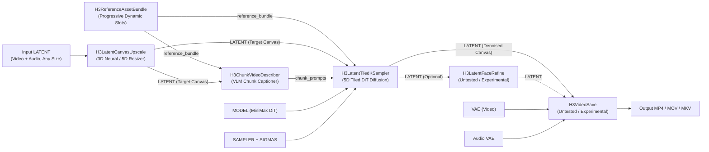

# ComfyUI-H3-TiledUpscale

[](https://opensource.org/licenses/Apache-2.0)
[](https://www.python.org/)
[](https://github.com/comfyanonymous/ComfyUI)

**Latent Tiled Video Super-Resolution for MiniMax H3 (Hailuo-01 / Ref2VA).**  
A ComfyUI Minimax H3 custom node to re-sample an existing video/latent in tiles in order to output larger resolutions.
Upscale video latents of **any input resolution** (e.g. 512p, 720p, 1080p) to **1080p (2.07 MP)**, **2K QHD (3.69 MP)**, **4K UHD (8.29 MP)**, and **8K UHD (33.18 MP)** directly in latent space while strictly preserving synchronized audio.

---

## Key Highlights

- **4K & 8K Video on Consumer GPUs**: Upscale high-resolution video that would typically require 80GB enterprise cards, running comfortably on 16GB–24GB consumer GPUs.
- **100% Synchronized Audio**: Never lose or desync your soundtrack. MiniMax H3's co-generated audio latents are preserved and aligned throughout the entire upscale.
- **Seamless Tiling Without Seams**: Advanced multi-scale frequency blending stitches spatial tiles cleanly with zero visible grid lines, color shifts, or edge blurring.
- **Lossless Quality (No VAE Roundtrips)**: Processes directly in latent space, avoiding repeated pixel encode/decode cycles that cause softness and color drift.
- **Automated AI Micro-Texture Prompting**: Optional Vision-Language Model (VLM) analyzes scene keyframes to automatically enrich prompts with crisp details like skin pores, fabric weaves, and reflections.
- **Plug & Play ComfyUI Integration**: Built entirely with standard ComfyUI data types (`LATENT`, `MODEL`, `SAMPLER`), easily fitting into your existing custom workflows.

---

## End-to-End Pipeline Architecture



---

## Installation

1. Navigate to your ComfyUI `custom_nodes` directory:
   ```bash
   cd ComfyUI/custom_nodes
   ```
2. Clone this repository:
   ```bash
   git clone https://github.com/metwigz/ComfyUI-H3-TiledUpscale.git
   ```
3. Install dependencies:
   ```bash
   cd ComfyUI-H3-TiledUpscale
   pip install -r requirements.txt
   ```
   *(If using ComfyUI Windows Portable, run `..\..\python_embeded\python.exe -m pip install -r requirements.txt`)*

---

## Node Suite Reference

### Core Nodes (Standard ComfyUI Types)

#### 1. `H3LatentCanvasUpscale` (Category: `H3-TiledUpscale/canvas`)
Pre-scales input 5D latents of **any arbitrary resolution** (e.g. 512×288, 720p, 1080p, or custom aspect ratios) to your target canvas dimensions.
* **Inputs**:
  * `latent` (`LATENT`): Source 5D video latent `[1, 24, T, H/16, W/16]` with optional audio latent.
  * `output_megapixels` (`FLOAT`, default: `8.29`): Target total resolution in megapixels.
  * `output_aspect_ratio` (`COMBO`): `Match_Input`, `16:9 (Widescreen)`, `9:16 (Vertical)`, `2.39:1 (Cinemascope)`, `4:3 (Classic)`, `1:1 (Square)`, `Custom`.
  * `framing_mode` (`COMBO`): `Crop_To_Fill`, `Pad_Letterbox`, `Stretch_Anamorphic`.
  * `upscale_method` (`COMBO`):
    * `Minimax H3 Latent Upscaler (3D)` *(Recommended)*: Uses trained 3D neural latent model.
    * `Latent_Trilinear (5D)`: Smooth 5D trilinear interpolation across $[C, T, H, W]$.
    * `Latent_Bicubic (Spatial)` / `Latent_Bilinear (Spatial)` / `Latent_Nearest_Exact`.
    * `Bypass (Pre-upscaled)`: Pass-through if latent is already at target resolution.
  * `latent_upscale_model` (`LATENT_UPSCALE_MODEL`, optional): Neural upscaler weights.
* **Outputs**:
  * `latent` (`LATENT`): Expanded 5D canvas latent. Preserves `audio_samples`.
  * `width` (`INT`): Target canvas width in pixels (e.g. `1920`, `2560`, `3840`, `7680`).
  * `height` (`INT`): Target canvas height in pixels (e.g. `1080`, `1440`, `2160`, `4320`).

##### Target Resolution Reference Table

| Target Standard | Aspect Ratio | Dimensions | `output_megapixels` Setting | Notes |
| :--- | :---: | :---: | :---: | :--- |
| **1080p FHD** | 16:9 | 1920 × 1080 | **`2.07`** | Standard high-definition output |
| **2K DCI** | ~1.9:1 | 2048 × 1080 | **`2.21`** | Cinema 2K production standard |
| **2K QHD (1440p)** | 16:9 | 2560 × 1440 | **`3.69`** | Ideal balance of speed & crisp detail |
| **4K UHD** | 16:9 | 3840 × 2160 | **`8.29`** | Default production 4K target |
| **4K DCI** | ~1.9:1 | 4096 × 2160 | **`8.85`** | Cinema 4K wide-screen |
| **8K UHD** | 16:9 | 7680 × 4320 | **`33.18`** | Ultra-high definition super-resolution |

#### 2. `H3ReferenceAssetBundle` (Category: `H3-TiledUpscale/reference`)
Consolidates multimodal references for MiniMax H3 Ref2VA conditioning (up to 9 pictures, 3 videos, 3 audios; capped at 12 total).
* **Features**: Dynamic UI slots (`js/h3_dynamic_ui.js`) that reveal additional inputs as you connect references, keeping the node footprint clean.
* **Inputs**: `picture_1`–`picture_9` (`IMAGE`), `video_1`–`video_3` (`IMAGE,VIDEO`), `audio_1`–`audio_3` (`AUDIO`).
* **Outputs**: `reference_bundle` (`H3_REFERENCE_BUNDLE`).

#### 3. `H3ChunkVideoDescriber` (Category: `H3-TiledUpscale/prompting`)
Samples keyframes across temporal chunks and generates canonical 6-section MiniMax H3 prompts (`subject_definitions`, `summary`, `retention_analysis`, `detailed_description`, `overall_soundscape`, `non_diegetic_music`).
* **Inputs**: `model` (`MODEL` VLM), `latent` (`LATENT`), `base_style_prompt` (`STRING`), `temporal_chunk_frames` (`INT`, default: `124`).
* **Features**: Enriches prompts with observed high-frequency micro-textures, cross-references connected reference images, and immediately purges VLM from GPU memory after captioning (0 GB VRAM leak).
* **Outputs**: `chunk_prompts` (`CHUNK_PROMPTS`), `master_prompt` (`STRING`), `saved_prompt_path` (`STRING`).

#### 4. `H3LatentTiledKSampler` (Category: `H3-TiledUpscale/sampling`)
Drop-in replacement for standard `KSampler` performing 5D tiled diffusion across spatial tiles and temporal chunks.
* **Inputs**:
  * `model` (`MODEL`), `latent_image` (`LATENT`), `sampler` (`SAMPLER`), `sigmas` (`SIGMAS`).
  * `denoise` (`FLOAT`, default: `0.40`): Denoising variance (`0.30–0.45` preserves identity while injecting 4K micro-textures).
  * `tile_megapixels` (`FLOAT`, default: `0.92`): Size per spatial tile. Setting $\le 0$ enables single-tile full-frame mode.
  * `overlap_percent` (`FLOAT`, default: `0.25`): Spatial tile overlap.
  * `tight_tile_overlap` (`BOOLEAN`, default: `True`): Minimizes tile size while strictly locking tile aspect ratio to canvas aspect ratio.
  * `spatial_blend_mode` (`COMBO`, default: `Multiscale_Laplacian`): Frequency band stitching.
  * `propagate_keyframes` (`BOOLEAN`, default: `True`): Auto-regressively passes trailing frame latent from Chunk $k-1$ as reference anchor into Chunk $k$.
  * `tile_storage_strategy` (`COMBO`): `temp_disk_stream` for $O(1)$ constant host RAM usage.
* **Outputs**: `latent` (`LATENT` 4K Denoised).

#### 5. `H3LatentFaceRefine` (Category: `H3-TiledUpscale/refinement`) — *[Untested / Experimental]*
> [!WARNING]
> **Untested**: This node is experimental and has not yet been thoroughly tested in production workflows.
Optional standalone face detailer operating 100% on 5D latent crops.
* **Features**: YOLOv8 face detection, EMA bounding box tracking across frames, localized Ref2VA identity restoration, and elliptical feather blending.
* **Inputs**: `latent` (`LATENT`), `model` (`MODEL`), `confidence_threshold` (`FLOAT`, default: `0.50`), `denoise` (`FLOAT`, default: `0.30`).
* **Outputs**: `latent` (`LATENT`).

#### 6. `H3VideoSave` (Category: `H3-TiledUpscale/export`) — *[Untested / Experimental]*
> [!WARNING]
> **Untested**: This node is experimental and has not yet been thoroughly tested in production workflows. You can alternatively decode with standard ComfyUI VAE Decode and save via Video Helper Suite (VHS) or standard video combine nodes.
High-performance video and audio multiplexer with in-flight VAE streaming decode and FFmpeg muxing.
* **Inputs**:
  * `latent` (`LATENT`): Denoised 5D latent.
  * `vae` (`VAE`): Video VAE.
  * `audio_vae` (`VAE`, optional): Audio VAE to decode synchronized soundtrack.
  * `output_dir` (`STRING`, default: `"output/4K_Upscales"`).
  * `filename_prefix` (`STRING`, default: `"H3_%date%_%resolution%_%counter%"`): Dynamic format tokens.
  * `format` (`COMBO`): `H.264 NVENC (MP4 - NVIDIA Fast)`, `HEVC NVENC (MP4 - NVIDIA Fast)`, `Apple ProRes 422 HQ (MOV)`, `H.264 (MP4)`, `AV1 (MP4)`.
  * `save_latent_copy` (`BOOLEAN`): Exports companion `.latent` file.
* **Outputs**: `saved_video_path` (`STRING`), `preview_frame` (`IMAGE`).

---

### Auxiliary Utilities

- **`H3TileCalculator`**: Independent grid calculator providing live overlap telemetry and VRAM sizing guidance before running sampling.
- **`H3AudioVAEDecode`** — *[Untested / Experimental]*: Decodes `latent["audio_samples"]` to standard ComfyUI `AUDIO` waveform.
- **`H3LoadLatentFromPath`**: Universal latent loader with automatic joint video+audio detection.
- **`H3SaveLatent`** — *[Untested / Experimental]*: Lossless serialization for 5D dual-key `NestedTensor([video, audio])` latents.
- **`H3VLMModelLoader`**: Dedicated loader for Vision-Language Models (`Qwen2.5-VL`, `Florence-2`) with `bf16`/`fp8` support.
- **`H3LatentUpscaleModelLoader`**: Universal loader supporting MiniMax 3D, HunyuanVideo, and LTX latent upscaler weights.

---

## Reference Workflow

A complete ready-to-run 4K upscale workflow is provided in the repository:
- [`examples/h3_tiled_upscale_example_01.json`](examples/h3_tiled_upscale_example_01.json)

Drag and drop this JSON file directly into ComfyUI to load the full 6-node standard pipeline.

---

## Mathematical Foundations

### MiniMax H3 Temporal Geometry (17k+5 / 5k+2 Causal Ratio)
The MiniMax H3 causal 3D VAE compresses temporal video frames into latent tokens using an exact affine mapping:
$$\text{frames} = \left(\frac{t_{\text{lat}} - 2}{5}\right) \times 17 + 5 \quad \text{for } t_{\text{lat}} \ge 2$$
$$\text{latents} = \left(\frac{\text{frames} - 5}{17}\right) \times 5 + 2 \quad \text{for } \text{frames} \ge 2$$

All chunk boundaries and seam intervals automatically snap to multiples of 17 frames (5 latent tokens) to prevent phase misalignment and eliminate boundary flashing.

### Multiscale Laplacian Frequency Decoupling
Spatial boundaries are blended across 5-level binomial Gaussian pyramids:
$$w_{2D} = \frac{1}{256} \begin{bmatrix} 1 & 4 & 6 & 4 & 1 \end{bmatrix}^T \begin{bmatrix} 1 & 4 & 6 & 4 & 1 \end{bmatrix}$$
- **Low Frequencies (Residual)**: Captures illumination, ambient colors, and large geometry from the base canvas.
- **High Frequencies (Detail Bands)**: Injects micro-textures synthesized by MiniMax DiT.
- Completely prevents brightness seams without creating blurry overlap bands.

---

## License

This project is licensed under the [Apache License 2.0](LICENSE).
